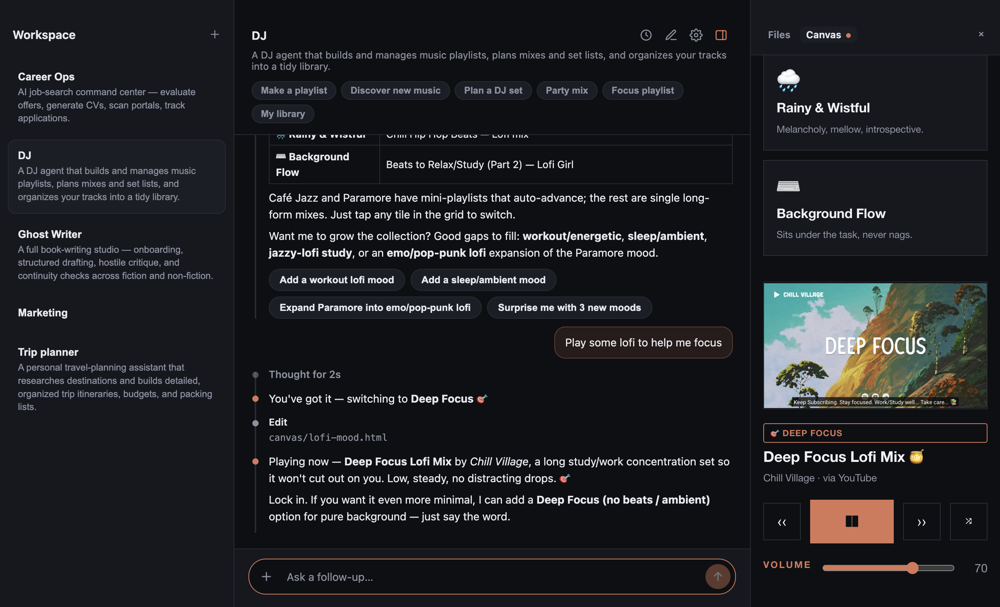
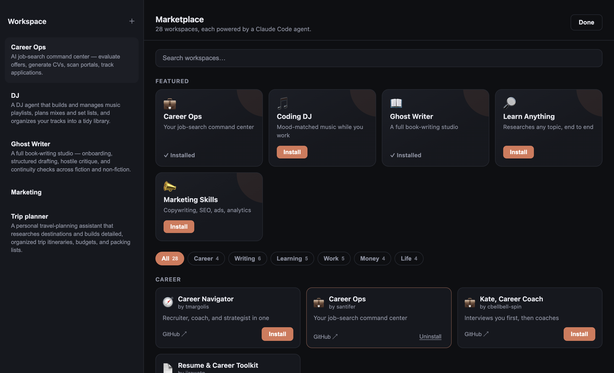
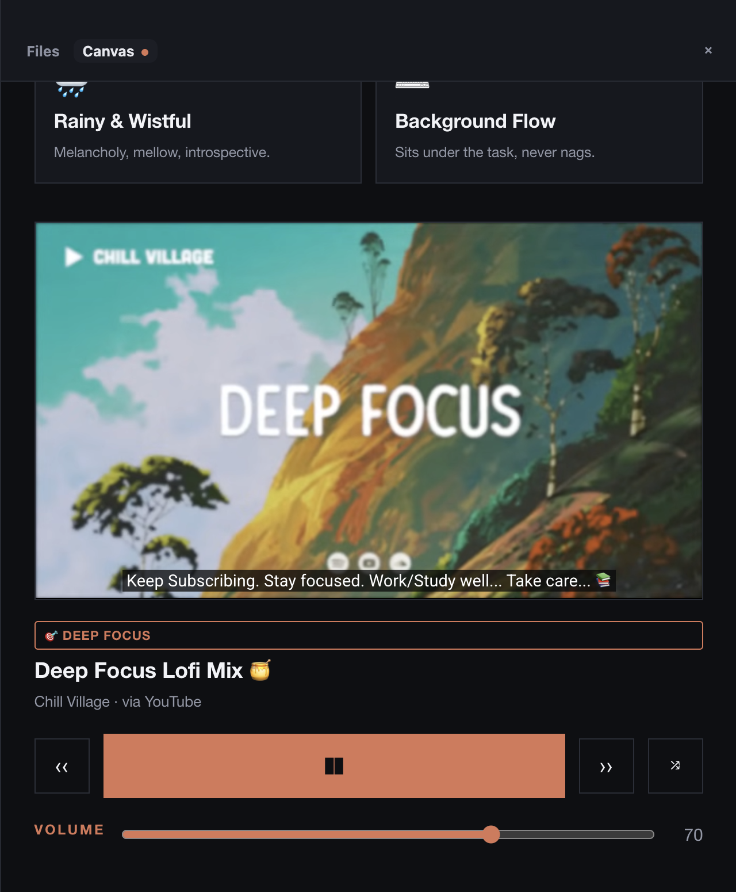

# Mocca

**Mocca doesn't replace Claude Code plugins — it gives them a home.** It installs
the **real** plugin (`plugin.json` + `SKILL.md`) straight from its repo and builds
the app around it: a marketplace to find it, a workspace of its own, and a Canvas
to build in. Powered by the [Claude Agent SDK](https://www.npmjs.com/package/@anthropic-ai/claude-agent-sdk).

<p align="center">
  <a href="https://github.com/valehelle/mocca-hub/releases/latest">
    
  </a>
  <br>
  <sub>Apple Silicon · signed &amp; notarized — no Gatekeeper warning · needs your own Claude access</sub>
</p>



> [!IMPORTANT]
> **You need your own paid Claude access.** Mocca runs agents through the Claude
> Agent SDK using *your* account — it does not ship a key and there is no free
> tier. Sign in with a **Claude subscription (Pro or Max)** — the same login
> Claude Code uses — or set an `ANTHROPIC_API_KEY` (billed per token). Without
> one, no agent will run.

---

## Why this exists

Claude Code plugins and skills are genuinely good, and you no longer need a
terminal to use Claude — good desktop apps exist. But three gaps remain, and
they're what Mocca is for:

- **There's no shelf.** Plugins spread by tweets, READMEs, and word of mouth.
  There's nowhere to browse what exists, see what one actually does, and install
  it in a click — so most people never learn they exist.
- **Artifacts aren't apps.** You can render a document. That's not a working
  player that holds its own state, keeps playing while you work, and calls back
  into the conversation.
- **Tools are built around the developer, not the agent.** You get one
  general-purpose assistant. Not: *this* one is a career coach — with its own
  workspace, files, memory, tools, and schedule — sitting next to your DJ and
  your tax helper.

## What it solves

### 1. A shelf you can browse
A built-in marketplace with 28 curated agents, grouped by category (Career,
Money, Work, Learning…). Open one and read what it *actually* does — its README,
its skills, and the tools it brings with it — before you install. You can also
install any Claude Code plugin straight from a GitHub repo (`owner/name`) or a
local folder, or have Claude author a new one from a one-line brief.



### 2. The Canvas — apps, not artifacts
Instead of walling the answer into chat, an agent writes a self-contained HTML app
that runs **live in the panel**: a comparison, a dashboard, a timeline, a working
music player. It's a real app — it handles its own interactions in-page, keeps
playing while you switch workspaces, and can call back through a small
`window.mocca` bridge (`chat.send`, `files.read/write/list`). Mocca injects its
design system, so whatever the agent builds looks native. Don't like what it made?
Say so — "make the player minimal, add a rain toggle" — and it rebuilds it.



Nothing above was hand-built: the agent wrote the player, wired every control, and
it keeps playing while you work in another workspace.

### 3. Built per agent, not per developer
Every agent is its own workspace: its own folder, its own chat threads (which keep
their memory), its own connected tools, and its own schedule. A DJ that plays music
and a tax helper that reads your PDFs aren't two modes of one assistant — they're
two apps, side by side, each set up for its job. Each gets file tools, sandboxed
Bash, web search, and a **headless browser** (Playwright) for pages `WebFetch`
can't read — plus per-workspace **MCP** connections (Linear, Notion, GitHub,
Sentry, Stripe) from a catalog, by name, or bundled by the plugin.

## How it works

- **Every agent is a workspace** — its own folder, its own chat threads (which keep
  their memory across restarts), and two folders you can see: `input/` for files
  you hand it, `output/` for everything it makes you.
- **Installing pulls the real plugin.** Marketplace entries are mostly metadata
  pointing at a repo; installing clones it so the agent's own files, skills, and
  MCP servers come along.
- **The agent is sandboxed.** Its Bash can only write inside its own workspace;
  package installs are redirected there too. Anything that reaches outside —
  `brew`, `sudo` — pauses and asks you first, and you can grant or revoke standing
  approvals per workspace.
- **The Canvas is untrusted.** It runs in a sandboxed iframe on a loopback origin,
  cross-origin to Mocca, reaching back only through workspace-scoped verbs.
- **Schedules** — run an agent on a timer (daily or every N minutes); the run
  continues its own thread.
- **Build your own** — give a name and a sentence about what it should do, and
  Claude authors it as a real, portable Claude Code plugin.

## Requirements

- **macOS (Apple Silicon).** That's what's built and tested.
- **A paid Claude account — required.** Mocca has no key of its own and no free
  tier; every agent runs on *your* Claude access. Either:
  - a **Claude subscription (Pro or Max)** — sign in once, the same way Claude
    Code does (Mocca reads that login); or
  - an **`ANTHROPIC_API_KEY`**, billed per token.

  Mocca checks on startup and tells you if it's missing. Settings shows your plan
  and how much of your usage window you've used.

## Install

**[Download the latest DMG →](https://github.com/valehelle/mocca-hub/releases/latest)**
Open it, drag Mocca to Applications, done.

The build is signed with a Developer ID and notarized by Apple, so it installs with
**no Gatekeeper warning** — no right-click-to-open dance. Apple Silicon (M1 or
newer) only; Intel Macs aren't supported yet.

## Build from source

```bash
npm install
npm start          # dev
npm run make       # signed + notarized release → out/make
```

Releasing (signing, notarization, verification) is documented in
[RELEASE.md](RELEASE.md).

## Adding an agent to the marketplace

Each entry is a folder under [`registry/`](registry/) with an `agent.json`:

```jsonc
{
  "id": "coding-dj",
  "name": "Coding DJ",
  "emoji": "🎵",
  "description": "Streams mood-matched background music while you work.",
  "allowedTools": ["Read", "Write", "Edit", "Bash", "WebSearch", "WebFetch"],
  "examplePrompt": "Play some lofi to help me focus for the next hour.",
  "source": "github:kennethleungty/claude-music",
  "category": "Work",
  "tagline": "Mood-matched music while you work"
}
```

`source` points at the Claude Code plugin to clone on install. Open a PR to add
yours.

## License

MIT © [Hazmi Irfan](https://github.com/valehelle)
